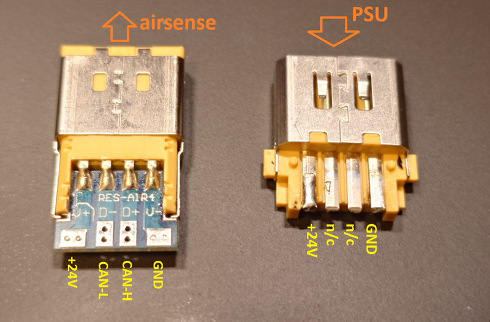
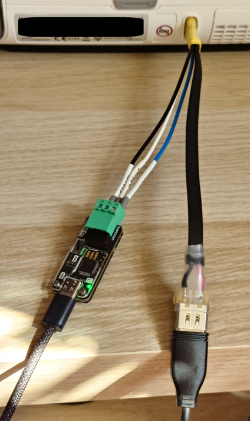

# AS11 CAN Connection

This is a stub bring-up document. It is meant to give users enough practical
information to build a first adapter and talk to the AS11 CAN service port.
The connector notes, adapter list, and mechanical details will need a more
careful rewrite later.

Protocol details are documented separately in [can_protocol.md](can_protocol.md).

## Contents

- [Scope](#scope)
- [Bus settings](#bus-settings)
- [Connector and pinout](#connector-and-pinout)
- [Adapter wiring](#adapter-wiring)
- [Tested adapters](#tested-adapters)
- [CAN-FD and STM32 adapter notes](#can-fd-and-stm32-adapter-notes)
- [Flashing WeAct USB2CANFDV1](#flashing-weact-usb2canfdv1)
- [Known limitations](#known-limitations)

## Scope

AS11 exposes a local CAN bus on the power connector area. The bus carries a
plaintext JSON-RPC service lane and a diagnostic log stream.

This document is about the physical connection and adapter choice only. It
does not describe a specific USB-CAN serial protocol and it does not replace
the protocol notes in [can_protocol.md](can_protocol.md).

## Bus settings

Observed settings:

| Setting | Value |
|---------|-------|
| Bitrate | 1 Mbps |
| Identifier format | standard 11-bit IDs |
| CAN frame format | classic CAN, 8-byte data frames |
| RPC request ID | `0x383` |
| RPC response ID | `0x382` |
| Debug log ID | `0x796` |

Use normal CAN mode for RPC. Silent mode is useful for passive sniffing, but
it does not ACK frames and is not the right mode for normal request/response
traffic.

## Connector and pinout

The original plug and socket appear to be custom OEM parts. So far the most
practical source for both mating connectors is salvaging a Pilot-24 cable kit:

- [Pilot-24 cable kit](https://www.amazon.com/dp/B0B3F7ZY65)

The photo below shows both connectors removed from a cable set.



With the connectors oriented as shown in the photo:

| Connector | Pin | Meaning |
|-----------|-----|---------|
| AirSense/device side | 1 | `+24V` |
| AirSense/device side | 2 | `CAN-L` |
| AirSense/device side | 3 | `CAN-H` |
| AirSense/device side | 4 | `GND` |
| PSU side | 1 | `+24V` |
| PSU side | 2 | not connected |
| PSU side | 3 | not connected |
| PSU side | 4 | `GND` |

Verify orientation before soldering. The photo labels are the current
reference; this document is still a stub.

## Adapter wiring

Minimal CAN adapter wiring:

| AS11 pin | Adapter pin |
|----------|-------------|
| `CAN-H` | `CAN-H` |
| `CAN-L` | `CAN-L` |
| `GND` | `GND` |

Do not connect `+24V` to a USB-CAN adapter unless the adapter documentation
explicitly requires external power. The tested USB adapters are powered from
USB.

An assembled adapter connected to the device:



## Tested adapters

Adapters that have been tested by the project. Price tags are approximate and
will vary by seller, region, and shipping.

| Adapter | Approx. price | Status | Notes |
|---------|---------------|--------|-------|
| [Jhoinrch RH02 Elite](https://www.amazon.com/dp/B0G6KHBGCJ) | ~ $30 | works reliably out of the box | Recommended current easy path. |
| [Jhoinrch RH02 Plus](https://www.amazon.com/dp/B0F9F9J3WN) | ~ $20 | works reliably out of the box | Recommended current easy path. |
| [LC_CANABLE_V2.1](https://www.amazon.com/dp/B0CPHQ2JDY) | ~ $15 | works reliably after firmware upgrade | Use [Elmue CANable 2.5 firmware](https://github.com/Elmue/CANable-2.5-firmware-Slcan-and-Candlelight). |
| [FYSETC UCAN](https://www.fysetc.com/products/fysetc-ucan-board) | ~ $10 | works reliably after firmware upgrade | Use the [Elmue project fork](https://github.com/m-kozlowski/CANable-2.5-firmware-Slcan-and-Candlelight) with STM32F0 and STM32G0 support |
| [WeAct USB2CANFDV1](https://aliexpress.com/item/1005007126451299.html) | ~ $10 | works reliably after firmware upgrade | Use the same [project fork](https://github.com/m-kozlowski/CANable-2.5-firmware-Slcan-and-Candlelight). Factory firmware replacement needs [OpenOCD unlock/program steps](#flashing-weact-usb2canfdv1) because of flash protection. |

The Waveshare USB-CAN-A serial adapter was useful during early exploration,
but it is not recommended for normal use. It can drop whole CAN frames under
pressure, which corrupts large RPC responses and makes flashing fragile.

## CAN-FD and STM32 adapter notes

AS11 traffic observed so far is classic CAN, not CAN-FD. A true CAN-FD adapter
is therefore not required for AS11 RPC or flashing.

The adapter MCU still matters when choosing firmware:

| STM32 family / peripheral | CAN-FD status | Practical note |
|---------------------------|---------------|----------------|
| STM32G0B / STM32G0C FDCAN | native CAN-FD | Proper CAN-FD capable parts. Not every STM32G0 has FDCAN, so check the exact marking. |
| STM32G4 FDCAN | native CAN-FD | Proper CAN-FD capable parts, common on newer USB-CAN-FD adapters. |
| STM32H7 FDCAN | native CAN-FD | Proper CAN-FD capable parts, usually overkill for this use. |
| STM32F0 / F1 / F3 / F4 / F7 with bxCAN | classic CAN only | Enough for AS11, but not a real CAN-FD adapter. Firmware support is partial if a project advertises CAN-FD features. |

For this project, "partial" usually means the adapter can do classic CAN well
enough for AS11, but it cannot send or receive CAN-FD data-phase frames because
the MCU does not have an FDCAN peripheral.

## Flashing WeAct USB2CANFDV1

The WeAct USB2CANFDV1 can be reflashed through SWD. The board exposes the SWD
pads along the lower edge. From left to right, with the board oriented like the
project reference image:

| Pad | Signal |
|-----|--------|
| 1 | `CLK` |
| 2 | `DIO` |
| 3 | `GND` |
| 4 | `3V3` |

Start OpenOCD:

```bash
openocd -f interface/stlink.cfg -f target/stm32g0x.cfg
```

In another terminal:

```bash
telnet localhost 4444
reset halt
stm32l4x option_write 0 0x20 0xffdfffaa
stm32l4x option_write 0 0x2C 0x000000FF
stm32l4x option_write 0 0x30 0x000000FF
stm32l4x option_load 0

program /path/to/STM32G0B1_Slcan2.5_WeActUSB2CANFDV1_0x*.bin 0x08000000 verify reset
```


## Known limitations

This page is intentionally incomplete:

- connector sourcing is based on the current salvage method, not an identified
  part number
- pinout notes should be rechecked against more cables and photos
- adapter firmware recommendations are based on current project testing
- no formal termination or signal-integrity guidance is documented yet

Treat this as a practical starting point, not final hardware documentation.
