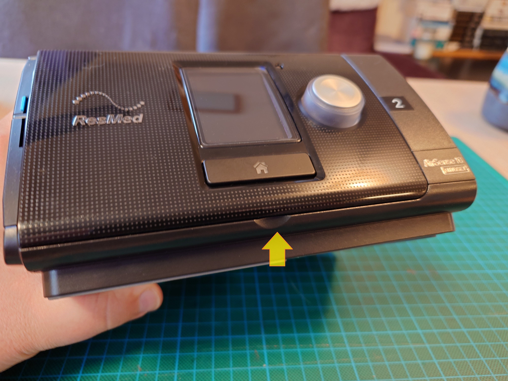
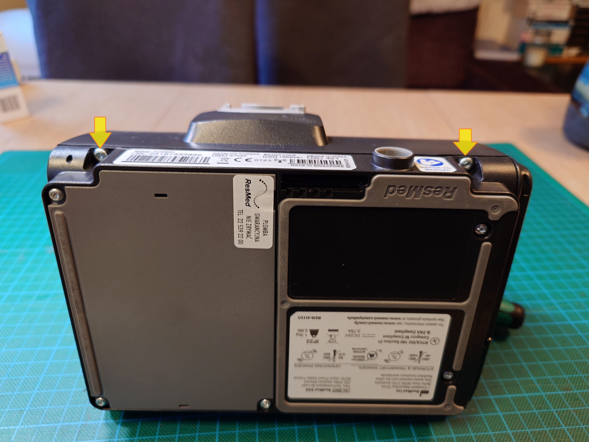
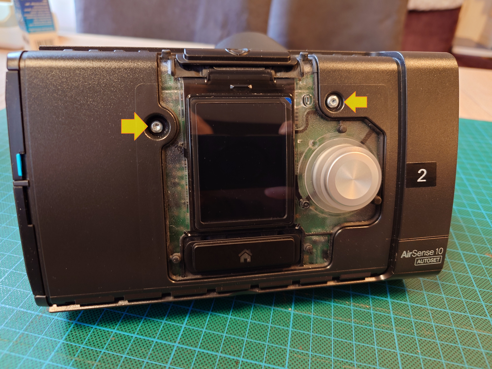
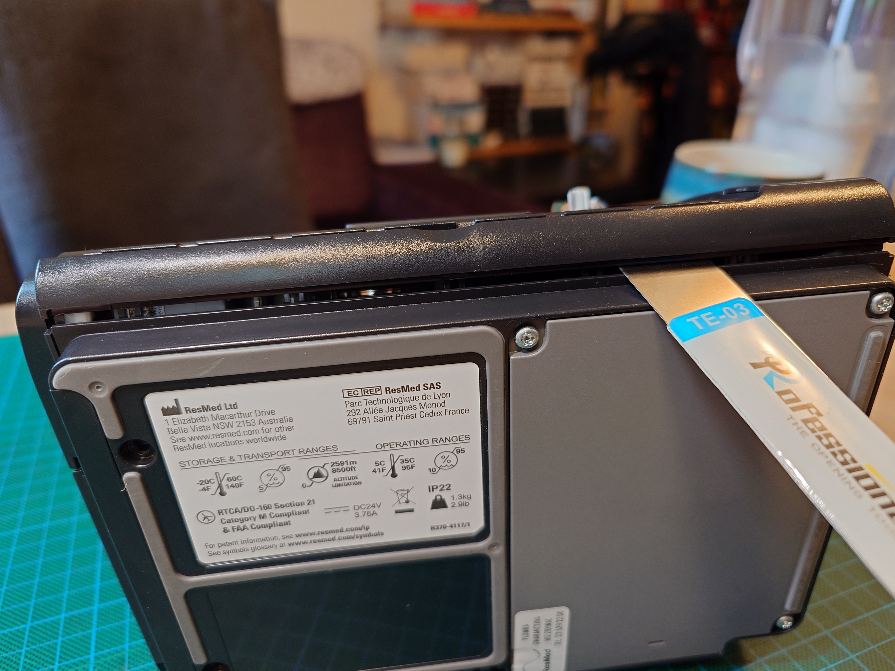
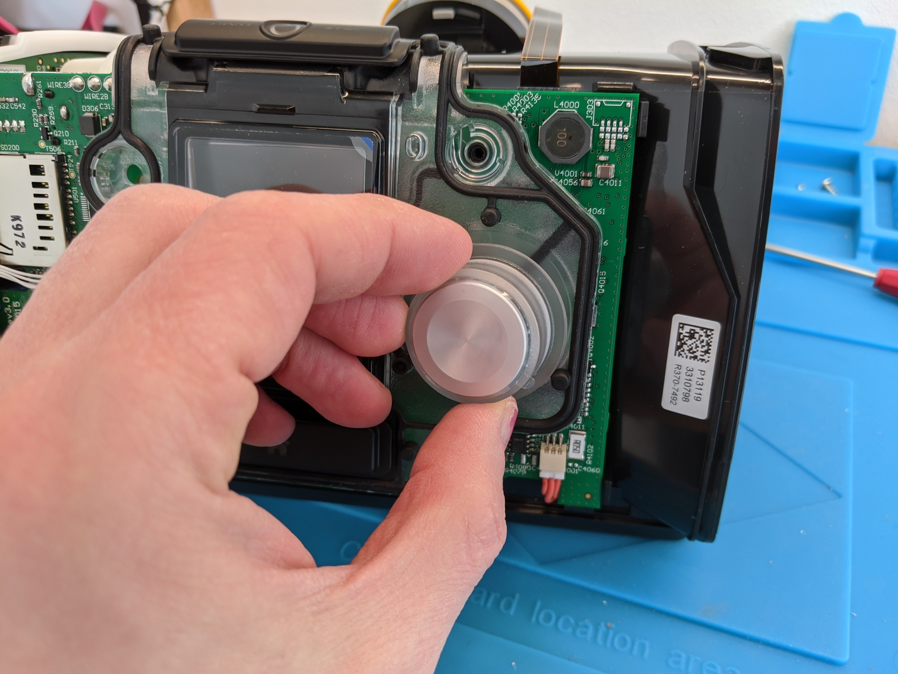
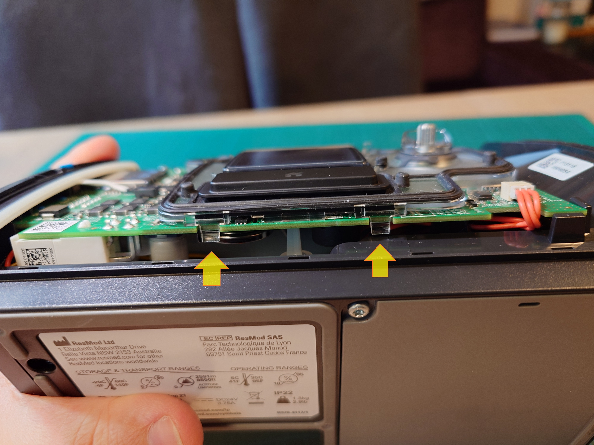
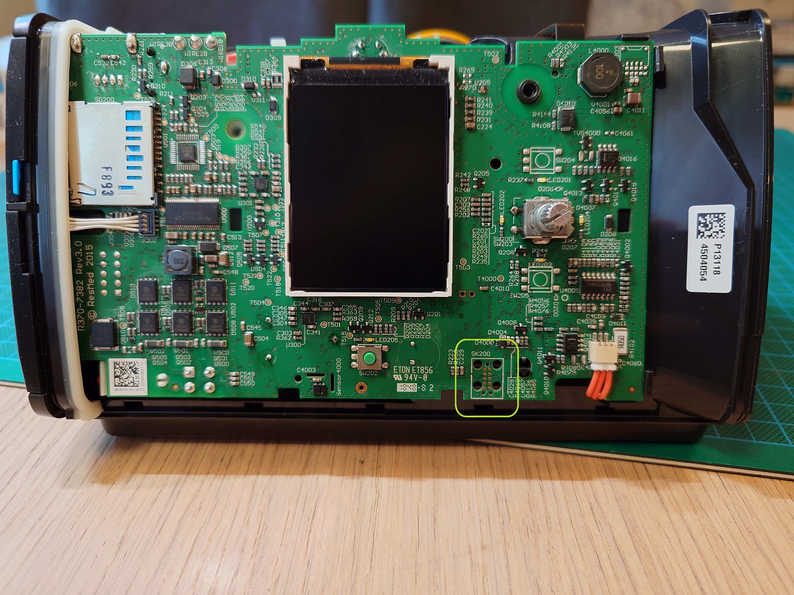

# Disassembly

Opening the AirSense 10 to access the programming header.

## Tools

- Torx T10 screwdriver
- Flat-head screwdriver or spudger

## Steps

### 1. Remove faceplate

The front faceplate is only clipped in place -- no screws. Pull it straight off.

### 2. Remove top cover

Unscrew the two bottom screws.

Unscrew the two front screws.

Pry off the cover starting at the front-bottom end. The bottom latches need to be pried open with a flat-head or a spudger.

### 3. Remove knob

Pull it straight off.

### 4. Remove LCD cover

Pop the two latches at the bottom.

Gently pull up and release two more latches on the sides. Be careful when lifting it off around the power button at the top of the device.

### 5. Done

The TC2050 programming header footprint is now accessible. You do not need to remove the circuit board.

## Reassembly

Reverse the steps. LCD cover snaps back, knob pushes on, top cover clips in and gets 4 screws, faceplate clips on.

## Next

[Wiring](wiring.md)
