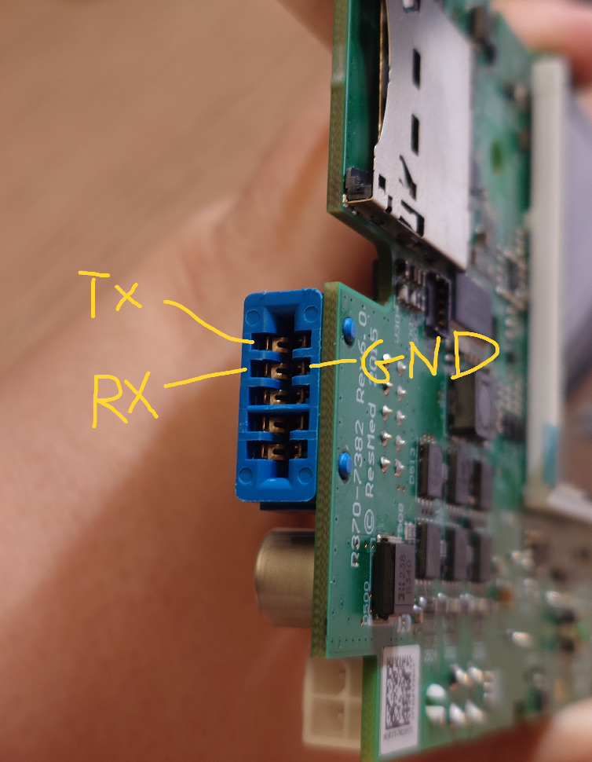

# Serial connection (UART)

Connecting to the AirSense 10 USART3 accessory port for flashing and configuration.

No device disassembly required. The accessory port is accessible from outside the device.

## What you need

- USB-serial adapter with 3.3V logic (CP2102, FTDI, CH340, etc.)
- Edge connector breakout board ([PCB files](../adapter_pcbs/)) or direct soldering
- Or: [AirBridge](https://github.com/m-kozlowski/airbridge) for WiFi access

## Edge connector pinout

The accessory port is a 10-pin edge connector on the side of the device.

| Left | Right |
|------|-------|
| **Tx** | nc |
| **Rx** | **GND** |
| nc | nc |
| nc | nc |
| nc | **+24V** |

UART: 3.3V logic, 57600 8N1.




## Wiring

| Device | Adapter | Signal |
|--------|---------|--------|
| Tx | RXD | Device transmit -> adapter receive |
| Rx | TXD | Adapter transmit -> device receive |
| GND | GND | Common ground |

Do not connect +24V to the USB-serial adapter.

> **Warning**: The UART signals are 3.3V. Do not use 5V serial adapters without a level shifter.

## Edge connector breakout

A simple breakout PCBs for the edge connector are available in [`docs/adapter_pcbs/`](../adapter_pcbs/).

## Verify connection

```
./python/resmed_config.py -p /dev/ttyACM0 info
```

If the device responds, you should see the bootloader ID, serial number, and product name.

## Usage

| Tool | Purpose |
|------|---------|
| [`resmed_config.py`](../tools/resmed_config.md) | Read/write device variables, dump/restore configuration |
| [`resmed_flash.py`](../tools/resmed_flash.md) | Flash firmware images |

See [flashing](flashing.md) for firmware transfer, or [resmed_config docs](../resmed_config.md) for configuration management.

