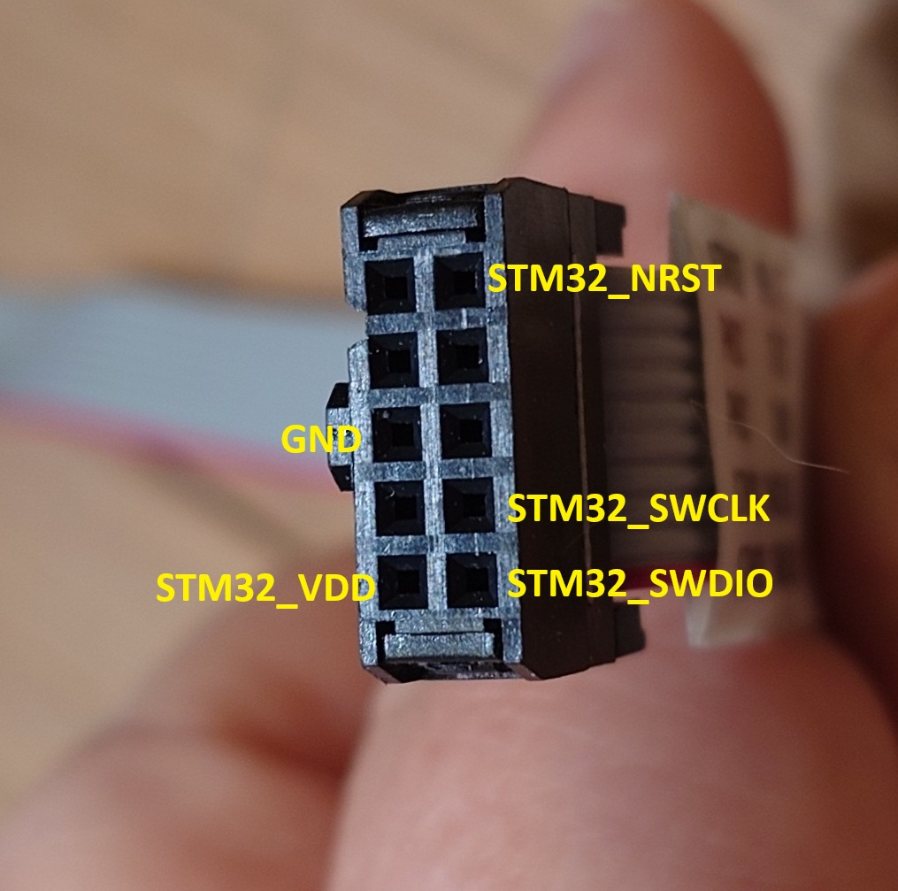
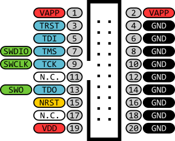
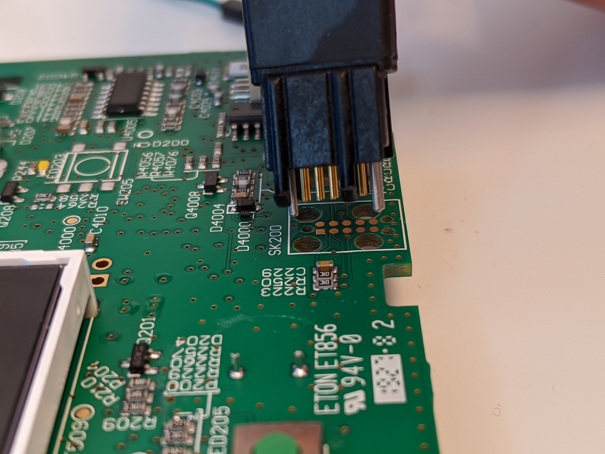

# Wiring

Connecting a SWD programmer to the AirSense 10 programming header.

## What you need

- SWD programmer: genuine ST-Link/V2, [WeAct MiniDebugger](https://github.com/WeActStudio/MiniDebugger) (recommended clone), or similar
- [TC2050-IDC](https://www.digikey.com/product-detail/en/TC2050-IDC/TC2050-IDC-ND/2605366) (with legs, good for development) or [TC2050-IDC-NL](https://www.digikey.com/product-detail/en/tag-connect-llc/TC2050-IDC-NL/TC2050-IDC-NL-ND/2605367) (no legs, hold by hand)
- 4-5 jumper wires (0.1" male-female)

## Programming header pinout

The board has a 10-pin TC2050 footprint. It combines pins for three chips (STM32, STM8, power watchdog). Only 4 pins are needed for the STM32 (5 if using genuine ST-Link).

### Board footprint (looking at the PCB)

| Function | Pin | Pin | Function |
|----------|-----|-----|----------|
| `STM32_VDD` | 1 (square) | 10 | `STM32_NRST` |
| `STM32_SWDIO` | 2 | 9 | `STM8_SWIM` |
| `STM8_VDD` | 3 | 8 | `PMIC_TDI` |
| `STM32_SWCLK` | 4 | 7 | `STM8_NRST` |
| `GND` | 5 | 6 | `PMIC_TDO` |

### TC2050 ribbon cable pinout (top view)

| Function | Pin | Pin | Function |
|----------|-----|-----|----------|
| **STM32_VDD** | 1 (red) | 2 | **STM32_SWDIO** |
| STM8_VDD | 3 | 4 | **STM32_SWCLK** |
| **GND** | 5 | 6 | PMIC_TDO |
| STM8_NRST | 7 | 8 | PMIC_TDI |
| STM8_SWIM | 9 | 10 | **STM32_NRST** |

Looking from the connector side:

### ST-Link/V2 genuine pinout

| Function | Pin | Pin | Function |
|----------|-----|-----|----------|
| **VREF** | 1 | 2 | -- |
| -- | 3 | 4 | -- |
| -- | 5 | 6 | -- |
| **SWDIO** | 7 | 8 | -- |
| **SWCLK** | 9 | 10 | -- |
| -- | 11 | 12 | -- |
| -- | 13 | 14 | -- |
| **NRST** | 15 | 16 | -- |
| -- | 17 | 18 | -- |
| -- | 19 | 20 | **GND** |

### Connections summary

| TC2050 pin | ST-Link pin | Signal |
|------------|-------------|--------|
| 2 | 7 | SWDIO |
| 4 | 9 | SWCLK |
| 5 | 20 | GND |
| 10 | 15 | NRST |

**Genuine ST-Link: also connect TC2050 pin 1 (red) to ST-Link pin 1 (VREF).** The genuine ST-Link uses this to sense target voltage and will not work without it. It does not supply power through this pin.

> **Warning**: Do not connect TC2050 pin 1 (VDD) to clone programmers. Clones often supply power through this pin, which will back-power the AirSense PCB and may damage the board or the programmer. Clone pinouts vary -- check your programmer's documentation.

## Alternative: UART-only (no SWD)

If you already have a firmware dump and only need to flash, you can use the USART3 accessory port instead of SWD. See [serial connection](serial_connection.md) for pinout and setup.

## Next

[Firmware dump](openocd.md)
